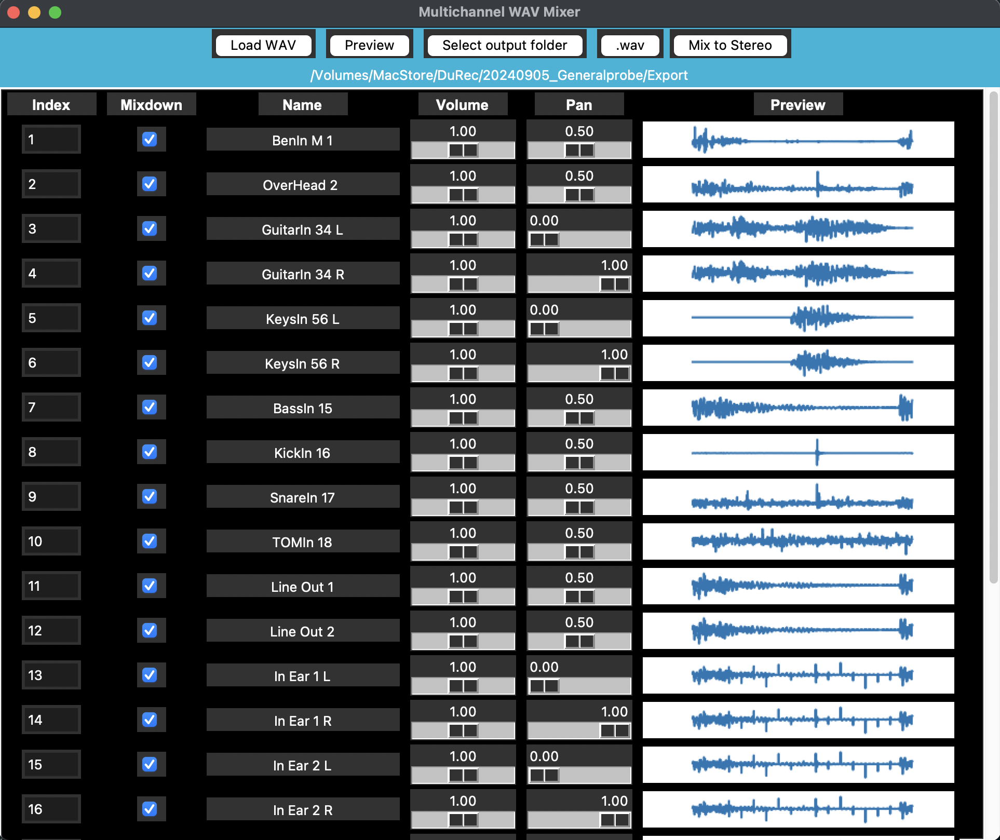
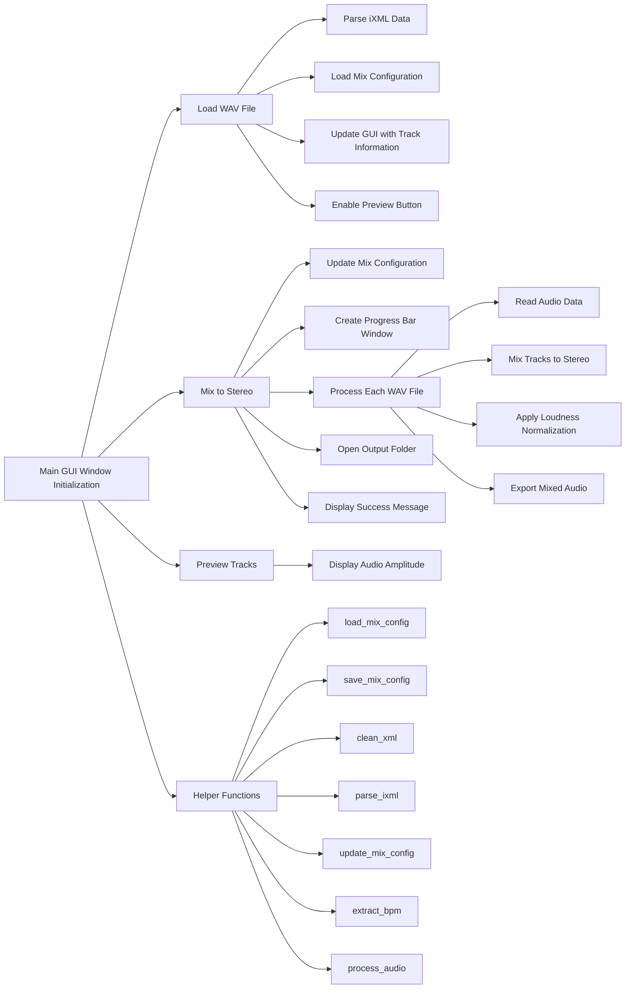

# MultiChannelWavMixer
Simple Downmix tool for Multichannel WV files compatible to RME Durec format

For installation Python environment is required. Use requirements.txt to install all dependencies.

## Description

`MultiChannelWavMixer.py` is a Python script designed to downmix multichannel WAV files into stereo or other channel configurations. It is particularly compatible with the RME Durec format, making it suitable for audio professionals who need to process recordings from RME audio interfaces.

### Installation
```sh
python -m venv .venv
source .venv/bin/activate  # On Windows use: .venv\Scripts\activate
pip install -r requirements.txt
```

### Features

- Downmix multichannel WAV files to stereo based on custom channel configurations.
- Compatible with RME Durec format.
- Supports batch processing of multiple files.
- Customizable downmix parameters.
- optional WAV or MP3 output
- Save Configuration in a config file (MixConf.json)

#### added 2025-02-09
  - add Loudness normalization feature with option -1dB Peak (default), -12dB LUFS and none (no normalization)

#### added 2025-02-05
  - double-click Volume slider >> set to 1.0
  - double-cklick Pan slider >> set to 0.5
  - Preview of audio channels using the first listed WAV file given


### Usage

To use `MultiChannelWavMixer.py`, run the script with the desired input and output file paths, along with any optional parameters for custom downmixing.

#### Example
```sh
python MultiChannelWavMixer.py
```

### GUI Layout

The GUI consists of the following elements:

- **Top Frame:**
  - Load WAV button
  - Preview button
  - Select output folder button
  - Toggle output format button
  - Mix to Stereo button
  - Loudness normalization dropdown menu

- **Bottom Frame:**
  - Output Path label
  - Output folder label

- **Frame Controls:**
  - Index entry
  - Mixdown checkbox
  - Name label
  - Volume slider
  - Pan slider


Rough preview of first WAV File helps to quickly identify the used tracks


### Structure

