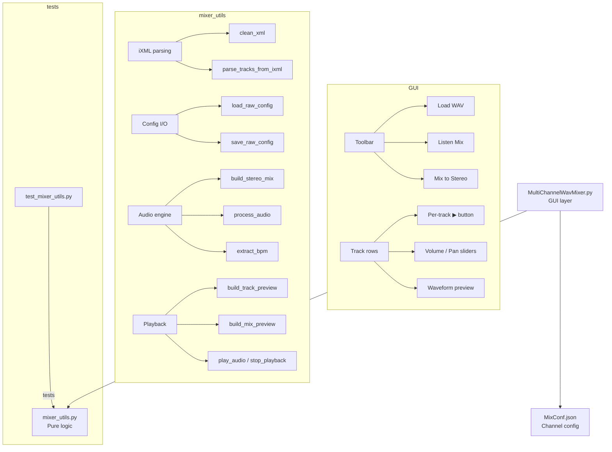

# MultiChannelWavMixer

A modern, dark-themed desktop tool for downmixing multichannel WAV files (RME Durec format) to stereo — with per-track volume, pan, live waveform preview, and in-app audio playback.

---

## Features

- Load one or multiple multichannel WAV files and batch-process them
- Automatically reads **iXML metadata** embedded in the WAV file to identify track names and channel order
- Per-track controls: **index**, **mixdown toggle**, **volume slider** (-60 dB – +6 dB), **pan slider** (L – R)
  - Double-click volume slider to reset to 0 dB (unity); double-click pan to reset to centre
  - Volume at or below -60 dB is treated as silence (no noise floor amplification)
- **Per-track playback** — click ▶ on any row to audition that channel in isolation, peak-normalised to -1 dBFS; click again to stop
- **Listen Mix ▶ / ■ Stop** — preview the full stereo mix with the current loudness-normalisation setting applied, without rendering a file; click again to stop
- **Waveform preview** — renders a mini amplitude plot for every channel; y-axis is fixed (−1 to +1) and amplitude is scaled by the current volume fader so tracks are visually comparable
- **Loudness normalisation**: none / -1 dBFS peak (default) / -12 dB LUFS
- **Automatic BPM detection** (librosa) — embedded in the output filename
- **Phase correction** — detects and fixes phase inversion during the export pipeline
- **Output format**: MP3 or WAV
- **Batch export** — processes every loaded file with a progress dialog
- Persists channel settings in **MixConf.json** and restores them on next load
- Compatible with **RME Durec** multichannel recorder format

---

## Requirements

- Python ≥ 3.13
- [uv](https://docs.astral.sh/uv/) package manager

---

## Installation & setup

```sh
# 1. Clone the repo
git clone https://github.com/MacBuchi/MultiChannelWavMixer.git
cd MultiChannelWavMixer

# 2. Create the virtual environment and install all dependencies
uv sync
```

That's it — `uv sync` reads `pyproject.toml`, creates `.venv`, and installs every dependency (including `audioop-lts` for Python 3.13 compatibility).

---

## Usage

```sh
uv run MultiChannelWavMixer.py
```

Or activate the venv and run directly:

```sh
source .venv/bin/activate
python MultiChannelWavMixer.py
```

> **Never** run with the system Python (`/usr/bin/python3` or `/opt/homebrew/bin/python3`) — dependencies are only installed inside `.venv`.

---

## GUI walkthrough

### Toolbar

| Control | Description |
|---|---|
| **Load WAV** | Open one or more multichannel WAV files; iXML metadata is parsed automatically |
| **Waveforms** | Render a mini waveform thumbnail for every track |
| **Output Folder** | Choose the export destination (auto-set to source folder on load) |
| **Loudness** | Select the normalisation target: `none`, `-1dBFS`, or `-12dB LUFS` |
| **Format** | Toggle between `MP3` and `WAV` export |
| **Listen Mix ▶** | Preview the current mix in real time (uses the selected loudness setting) |
| **Mix to Stereo ▶** | Export all loaded files to disk |

### Track rows

| Column | Description |
|---|---|
| **#** | Channel index (1-based, editable) |
| **Mix** | Checkbox — include this track in the mixdown |
| **Track Name** | Name read from iXML |
| **Volume** | -60 dB – +6 dB gain slider; double-click to reset to 0 dB; live dB readout |
| **Pan** | L (0) – R (1) slider; live numeric readout |
| **▶** | Play this channel in isolation (peak-normalised to -1 dBFS); click again to stop. Starting playback on another track or Listen Mix stops this one automatically. |
| **Waveform** | Mini amplitude plot (appears after clicking *Waveforms*) |

### Status bar

Displays the currently selected output folder.

---

## Running tests

```sh
# Run the full test suite
uv run pytest -v

# With coverage report
uv run pytest --cov=mixer_utils --cov-report=term-missing
```

All 71 tests are GUI-free and live in `tests/test_mixer_utils.py`.

---

## Development workflow

All development happens on the `dev` branch. `Main` is the release branch — direct commits are not used.

```
dev  →  Pull Request  →  Main
         (CI checks)      (Release triggered)
```

### Commit message convention

This project uses [Conventional Commits](https://www.conventionalcommits.org/). The commit prefix determines whether and how the version is bumped on merge:

| Prefix | Example | Version bump |
|---|---|---|
| `fix:` | `fix: handle empty iXML gracefully` | Patch (`1.0.0 → 1.0.1`) |
| `feat:` | `feat: add LUFS meter to toolbar` | Minor (`1.0.0 → 1.1.0`) |
| `feat!:` or `BREAKING CHANGE` | `feat!: drop Python 3.12 support` | Major (`1.0.0 → 2.0.0`) |
| `chore:`, `docs:`, `ci:`, `refactor:`, `test:` | — | No bump |

### CI workflow (on every PR to `Main`)

1. **Lint** — `ruff check` and `ruff format --check` (ubuntu-latest)
2. **Run Tests** — `uv run pytest` with JUnit XML output; results are posted as a named check on the PR
3. **Build** (parallel matrix — macOS ARM, macOS Intel, Windows) — verifies the PyInstaller build completes and the app survives a 10-second smoke test

### Release workflow (on merge to `Main`)

Two separate workflows fire in sequence:

1. **`bump.yml`** — [commitizen](https://commitizen-tools.github.io/commitizen/) reads commits since the last tag, bumps the version in `pyproject.toml`, and pushes an annotated git tag (e.g. `v1.1.0`). If no releasable commits are found the workflow exits cleanly with no release.
2. **`release.yml`** — triggered by the new tag; builds the app on all three platforms (macOS ARM, macOS Intel, Windows), runs a smoke test on each, and publishes a [GitHub Release](https://github.com/MacBuchi/MultiChannelWavMixer/releases) with the zip artifacts attached.

> A failed build job can be re-run directly from the Actions tab without re-bumping the version, because the build and the bump are decoupled.

---

## Project structure

```
MultiChannelWavMixer/
├── MultiChannelWavMixer.py      # GUI application (customtkinter)
├── mixer_utils.py               # Pure audio logic — no GUI dependency
├── MultiChannelWavMixer.spec    # PyInstaller build spec (cross-platform)
├── pyi_rth_env.py               # PyInstaller runtime hook (PATH for pydub/ffmpeg)
├── build.sh                     # Local build helper (wraps pyinstaller spec)
├── MixConf.json                 # Persisted channel configuration
├── pyproject.toml               # UV project, dependencies & commitizen config
├── uv.lock                      # Locked dependency graph
├── AGENTS.md                    # AI coding agent instructions
├── .python-version              # Pins Python 3.13
├── requirements.txt             # Legacy reference (use uv sync instead)
├── .github/
│   └── workflows/
│       ├── ci.yml               # PR checks: lint → tests → build + smoke test
│       ├── bump.yml             # Merge to Main: commitizen version bump + tag push
│       └── release.yml          # Tag push: build matrix + smoke test + GitHub Release
├── tests/
│   └── test_mixer_utils.py      # Unit tests for mixer_utils
└── doc/
    └── Preview.png
```

### `mixer_utils.py` public API

| Function | Description |
|---|---|
| `clean_xml(data)` | Strip junk before `<?xml` and remove non-printable chars |
| `parse_tracks_from_ixml(ixml_str)` | Parse iXML string → list of plain-dict track descriptors |
| `load_raw_config(path)` | Load `MixConf.json` as plain Python dicts |
| `save_raw_config(config, path)` | Persist channel config to JSON |
| `build_stereo_mix(data, tracks)` | Downmix multichannel numpy array to stereo |
| `process_audio(wav_in, ...)` | Phase check, normalise, strip silence, apply fades |
| `extract_bpm(y, sr)` | Estimate tempo via librosa |
| `db_to_linear(db, floor_db)` | Convert dB value to linear gain; returns 0.0 at or below floor |
| `build_track_preview(data, ch)` | Extract one channel as peak-normalised stereo float32 |
| `build_mix_preview(data, tracks, sr, mode)` | Build normalised stereo preview mix |
| `play_audio(data, sr, on_finished)` | Non-blocking playback via `sd.OutputStream`; only one stream open at a time; stop is signalled via callback event (no `Pa_StopStream`, no AUHAL -50 on macOS) |
| `stop_playback()` | Signal the active stream's callback to stop; thread-safe no-op when idle |

---

## Architecture


```mermaid
graph TD
    A[MultiChannelWavMixer.py\nGUI layer] -->|imports| B[mixer_utils.py\nPure logic]
    A --> C[MixConf.json\nChannel config]

    subgraph GUI
        A1[Toolbar] --> A2[Load WAV]
        A1 --> A3[Listen Mix]
        A1 --> A4[Mix to Stereo]
        A5[Track rows] --> A6[Per-track ▶ button]
        A5 --> A7[Volume / Pan sliders]
        A5 --> A8[Waveform preview]
    end

    subgraph mixer_utils
        B1[iXML parsing] --> B2[clean_xml]
        B1 --> B3[parse_tracks_from_ixml]
        B4[Config I/O] --> B5[load_raw_config]
        B4 --> B6[save_raw_config]
        B7[Audio engine] --> B8[build_stereo_mix]
        B7 --> B9[process_audio]
        B7 --> B10[extract_bpm]
        B11[Playback] --> B12[build_track_preview]
        B11 --> B13[build_mix_preview]
        B11 --> B14[play_audio / stop_playback]
    end

    subgraph tests
        T[test_mixer_utils.py] -->|tests| B
    end
```

---

## Changelog

| Date | Change |
|---|---|
| 2026-03-05 | CI/CD: split release into `bump.yml` (tag) + `release.yml` (tag-triggered build); add macOS Intel runner (`macos-15-intel`); add lint step; add smoke test on all platforms; fix `llvmlite` x86_64 build failure via uv override |
| 2026-03-04 | CI/CD: add `ci.yml` (PR checks) and `release.yml` (multi-platform release); conventional commits drive automatic versioning via commitizen |
| 2026-02-20 | Volume fader changed to dB scale (-60 – +6 dB); -60 dB treated as silence; double-click resets to 0 dB |
| 2026-02-20 | Waveform y-axis fixed (-1 to +1); amplitude scaled by volume fader for visual comparability |
| 2026-02-20 | Playback rewritten with `sd.OutputStream` callback + per-stream stop `Event`; `Pa_StopStream` never called → AUHAL error -50 eliminated on macOS |
| 2026-02-20 | `_active_stream` module-level ref prevents GC-induced segfault when interacting with GUI during playback |
| 2026-02-20 | Per-stream `on_finished` closures capture their own button ref; finishing old stream no longer resets the new stream's ■ button |
| 2026-02-20 | Generation counter + launch thread: starting a new track while one is playing is deadlock-free |
| 2026-02-19 | Migrate to **uv** + `pyproject.toml`; upgrade to Python 3.13; add `audioop-lts` |
| 2026-02-19 | Full UI rewrite with **customtkinter** (dark mode, sliders with live readout, segmented format button, status bar) |
| 2026-02-19 | Extract pure logic into `mixer_utils.py`; add 71 unit tests |
| 2026-02-19 | Per-track ▶ playback buttons; **Listen Mix ▶** toolbar button for live mix preview |
| 2025-02-13 | Add librosa BPM detection; close waveform figures after creation |
| 2025-02-09 | Add loudness normalisation: -1 dBFS peak, -12 dB LUFS, none |
| 2025-02-05 | Double-click sliders to reset; waveform amplitude preview |
