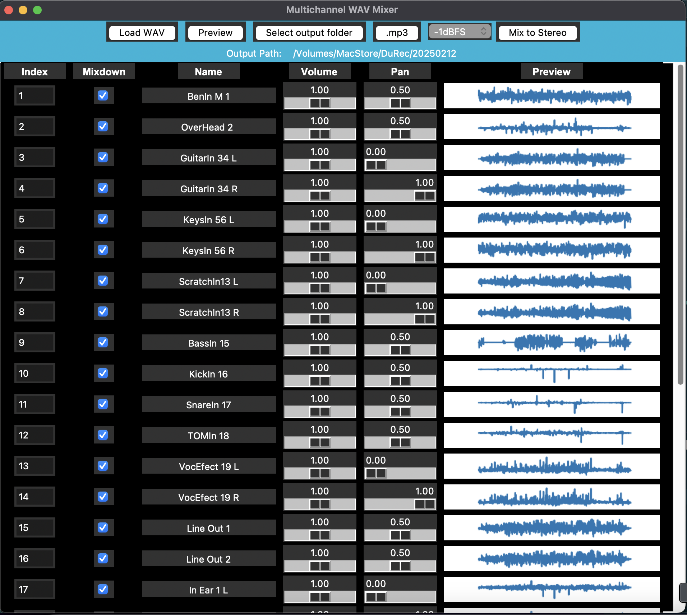

# MultiChannelWavMixer
Simple Downmix tool for Multichannel WV files compatible to RME Durec format

For installation Python environment is required. Use requirements.txt to install all dependencies.

```sh
python -m venv .venv
source .venv/bin/activate  # On Windows use: .venv\Scripts\activate
pip install -r requirements.txt
```


Rough preview of first WAV File helps to quickly identify the used tracks


Structure:
